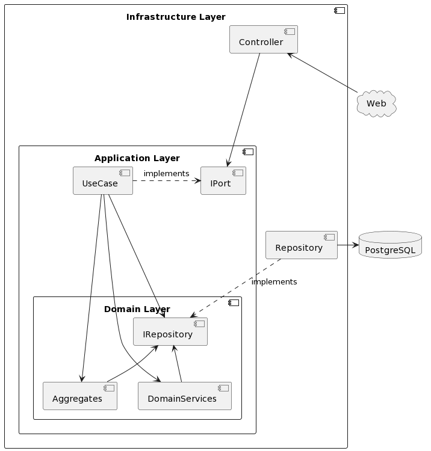

# Protokoll MTCG

## Design

### Projektstruktur

Ich habe mich bei dem Projekt für Domain Driven Design entschieden, da ich diese Architektur ausprobieren wollte und
diese sich hier gut angeboten hat.

Das Projekt ist wie foglt strukturiert:

#### Domain Layer

Hier befindet sich die ganze Domainlogik. Im Domain Layer wird ausschließlich Domainlogik behandelt und Schnittstellen
definiert (z.B. für Datenbankzugriffe), welche die äußeren Layer implementieren müssen.

#### Application Layer

Dieser Layer verbindet den Infrastructure Layer und den Domain Layer. Hier werden Daten vom Infrastructure Layer
gesammelt, validiert und an den Domain Layer weitergegeben.

#### Infrastructure Layer

Hier werden alle Datenbankzugriffe, welche der Domain oder Application Layer definiert hat, implementiert. Weiters
werden hier auch alle Endpunkte definiert und bei einem Request wird die dementsprechende Logik im Application Layer
aufgerufen.

### Projektdesign

#### Framework für HTTP Endpunkte

Ich hab ein Framework gebaut, mit welchem ich über Attribute alle Endpunkte der Applikation definieren kann. Wenn ein
Request eingeht, sucht das Framework die passenden Methode für den Request, führt diese aus und schickt das Ergebnis
als Response zurück.

#### HTTP Server Ablauf

Beim Start der Applikation wird ein TCP Socket gestartet, welcher Verbindungen akzeptiert. Sobald eine Verbindung zu
einem Client aufgebaut worden ist, wird dieser Reqeust in einem neuen Thread abgearbeitet und am Ende eine Response
zurückgeschickt.

Bei einer Exception wird eine Response mit dem entsprechenden Fehler und Fehlercode zurückgeschickt.

#### Security

Man kann konfigurieren, welche Routen von welchen Rollen aufgerufen werden dürfen. Jeder User hat eine Rolle. Ist jemand
nicht eingeloggt, so hat er die Rolle "anonymousRole".

#### Repository Pattern

Alle Datenbankzugriffe erfolgen über "Repositories", welche der Domain Layer definiert und der Infrastructure Layer
implementiert.

#### Battle

Wenn ein User ein Battle starten will, wird am Server ein neuer Thread für den Ablauf des Battles erstellt. Dieser
Thread wartet dann so lange, bis ein zweiter User dazukommt. Sobald zwei User bereit für ein Battle sind, handelt der
Thread das Battle ab und das Ergebnis wird an beide User zurückgegeben.

Eine Response wird dem User erst zurückgeschickt, sobald der Battle Thread fertig ist.

## Lessons learned

### Neue Technoligien

Ich habe bis jetzt noch nicht so viel mit C# und PostgreSQL gearbeitet und habe sehr viel über diese Technologien
gelernt.

### Architektur Overkill

Da ich im Zuge dieses Projektes Domain Driven Design ausprobieren wollte habe ich gemerkt, dass diese Architektur eher
für große Projekte geeinet ist. Es war trotzdem sehr angenehm zu programmieren, jedoch habe ich sehr viele Klassen
erstellen müssen, welche in diesem Umfang nicht alle nötig gewesen wären.

### HTTP mit Sockets implementiert

Ich habe zum ersten mal richtig mit Sockets in C# gearbeitet und einiges im Umgang mit Sockets gelernt.

## Unit testing decisions

Ich habe mich für Unit Tests auf den Domain Layer fokusiert, da hier die Kernlogik der Application implementiert ist und
diese dementsprechend gut getestet werden muss.

Beim Application und Infrastructure Layer ist es nicht so wichtig, eine hohe Test Coverage zu haben, da diese Layer
Logik enthalten, welche potenziel oft geändert wird (Endpunkte, Datenbankzugriffe, etc.) und nicht die Kernlogik abbilden.

## Unique feature

Als Unique feature habe ich einen Shop eingebaut, in dem man seine eigenen Karten zu einem bestimmten Preis verkaufen
kann.
Hier sind die Preise der Karten:

| Kartenklasse | Preis in Münzen |
|--------------|-----------------|
| Troll        | 2               |
| Goblin       | 2               |
| Ork          | 2               |
| Elf          | 3               |
| Spell        | 3               |
| Wizard       | 5               |
| Knight       | 5               |
| Dragon       | 10              |
| Kraken       | 10              |

## Tracked time

Ich habe in etwa 60h für das Projekt gebraucht.

## Link to GitHub

https://github.com/mr-tobi/mtcg
